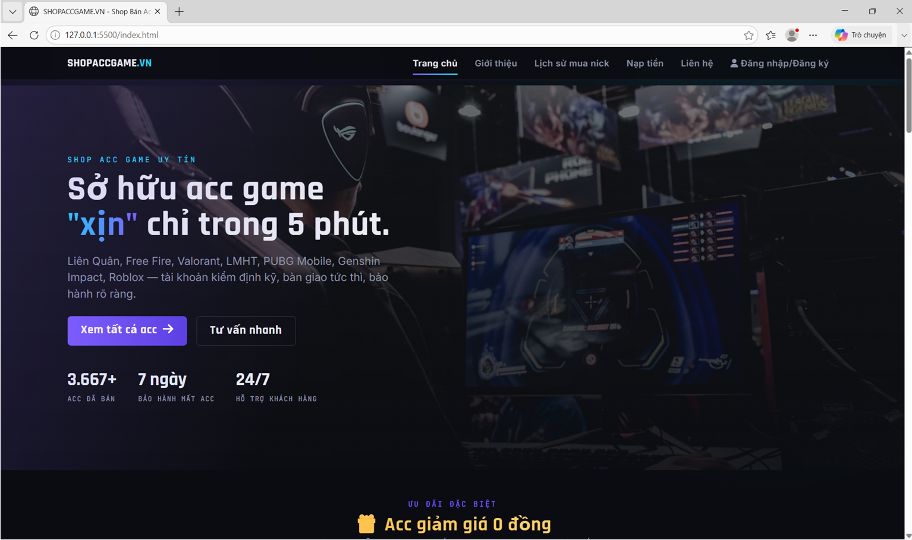
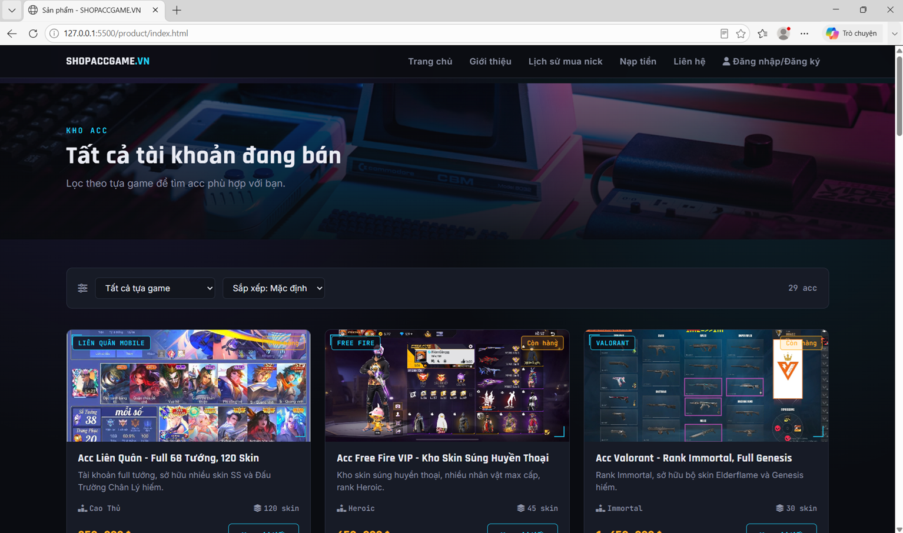
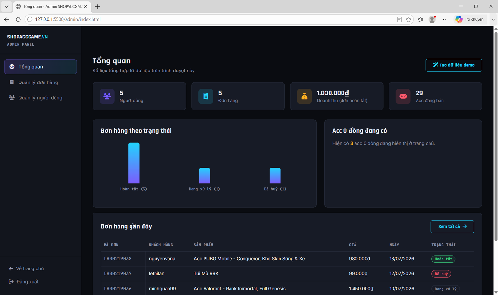

<div align="center">

# 🎮 SHOP ACC GAME

### Website bán tài khoản game trực tuyến


> Dự án website bán tài khoản game được xây dựng nhằm phục vụ mục đích học tập và thực hành phát triển Web Front-end.

</div>

---

# 📖 Giới thiệu

**Shop Acc Game** là website mô phỏng một hệ thống bán tài khoản game trực tuyến.

Website cho phép người dùng:

- Đăng ký tài khoản
- Đăng nhập
- Xem thông tin tài khoản game
- Tìm kiếm sản phẩm
- Mua tài khoản
- Quản lý hồ sơ cá nhân
- Xem lịch sử mua hàng

Ngoài ra website còn có trang **Admin Dashboard** để quản lý người dùng và đơn hàng.

---

# ✨ Tính năng

## 👤 Người dùng

- 🔐 Đăng ký tài khoản
- 🔑 Đăng nhập / Đăng xuất
- 👤 Quản lý thông tin cá nhân
- 💰 Quản lý số dư (LocalStorage)
- 🎮 Xem danh sách tài khoản game
- 🔍 Tìm kiếm sản phẩm
- 📄 Xem chi tiết sản phẩm
- 🛒 Mua tài khoản
- 📦 Xem lịch sử đơn hàng

---

## 👑 Quản trị viên

- Dashboard
- Quản lý người dùng
- Quản lý đơn hàng
- Thống kê dữ liệu

---

# 🎮 Danh mục game

- Liên Quân Mobile
- Free Fire
- PUBG Mobile
- Valorant
- Liên Minh Huyền Thoại
- Genshin Impact
- Roblox

---

# 🛠️ Công nghệ sử dụng

| Công nghệ | Mô tả |
|-----------|------|
| HTML5 | Xây dựng cấu trúc website |
| CSS3 | Thiết kế giao diện |
| JavaScript | Xử lý chức năng |
| Bootstrap 5 | Responsive UI |
| jQuery | Hỗ trợ xử lý DOM |
| Font Awesome | Icon |
| LocalStorage | Lưu dữ liệu người dùng |

---

## 📂 Cấu trúc thư mục

```text
shopaccgame/
│
├── index.html                         # Trang chủ
│
├── about/                             # Trang giới thiệu
│   └── index.html                     # Giao diện trang giới thiệu
│
├── admin/                             # Chức năng quản trị
│   ├── index.html                     # Dashboard quản trị
│   ├── login.html                     # Đăng nhập Admin
│   ├── orders.html                    # Quản lý đơn hàng
│   ├── users.html                     # Quản lý người dùng
│   ├── admin.css                      # CSS cho trang quản trị
│   └── admin.js                       # JavaScript cho trang quản trị
│
├── auth/                              # Chức năng xác thực
│   ├── index.html                     # Đăng nhập / Đăng ký
│   ├── auth.css                       # CSS xác thực
│   └── auth.js                        # JavaScript xác thực
│
├── common/                            # Tài nguyên dùng chung
│   ├── css/
│   │   └── style.css                  # CSS dùng chung
│   │
│   ├── js/
│   │   ├── script.js                  # JavaScript dùng chung
│   │   └── products.js                # Dữ liệu và xử lý sản phẩm
│   │
│   ├── images/
│   │   ├── home.png                   # Ảnh giao diện trang chủ
│   │   ├── product.png                # Ảnh giao diện trang sản phẩm
│   │   ├── admin.png                  # Ảnh giao diện trang quản trị
│   │   ├── products/                  # Hình ảnh sản phẩm
│   │   └── roster/                    # Hình ảnh nhân vật/game
│   │
│   └── vendor/
│       ├── bootstrap.min.css          # Thư viện Bootstrap CSS
│       ├── bootstrap.bundle.min.js    # Thư viện Bootstrap JS
│       └── jquery.min.js              # Thư viện jQuery
│
├── contact/                           # Trang liên hệ
│   ├── index.html                     # Giao diện liên hệ
│   └── contact.css                    # CSS trang liên hệ
│
├── deposit/                           # Trang nạp tiền
│   ├── index.html                     # Giao diện nạp tiền
│   └── deposit.css                    # CSS trang nạp tiền
│
├── history/                           # Lịch sử giao dịch
│   ├── index.html                     # Giao diện lịch sử
│   └── history.css                    # CSS lịch sử
│
├── product/                           # Chức năng sản phẩm
│   ├── index.html                     # Danh sách sản phẩm
│   └── detail.html                    # Chi tiết sản phẩm
│
└── README.md                          # Mô tả dự án
```

---

# 🚀 Hướng dẫn cài đặt

Clone project

```bash
git clone https://github.com/huynt07/shopaccgame.git
```

Di chuyển vào thư mục

```bash
cd shopaccgame
```

Mở project bằng **Visual Studio Code**

Cài đặt tiện ích:

- Live Server

Sau đó nhấn

```
Open with Live Server
```

Hoặc mở trực tiếp file

```
index.html
```

---

# 📸 Giao diện

## Trang chủ



---

## Trang sản phẩm



---

## Trang Admin



---

# 💡 Kiến thức áp dụng

- HTML Semantic
- CSS Flexbox
- CSS Grid
- Responsive Design
- Bootstrap
- JavaScript ES6
- DOM Manipulation
- Event Handling
- LocalStorage
- Responsive Navigation
- Form Validation

---

# 🎯 Mục tiêu dự án

- Thực hành HTML/CSS/JavaScript
- Thiết kế giao diện Responsive
- Xây dựng website thương mại điện tử đơn giản
- Làm quen với Bootstrap
- Thực hành thao tác với LocalStorage
- Củng cố kỹ năng Front-end

---

# 🔮 Hướng phát triển

- Kết nối cơ sở dữ liệu
- Đăng nhập bằng JWT
- Thanh toán trực tuyến
- Quản lý sản phẩm
- Thêm giỏ hàng
- Chat với khách hàng
- Đánh giá sản phẩm
- Phân quyền người dùng

---

# 👨‍💻 Tác giả

*Nguyễn Thanh Huy*

GitHub: https://github.com/huynt07

---

# 🤝 Liên hệ

Nếu bạn có bất kỳ câu hỏi, góp ý hoặc đề xuất cải thiện dự án, hãy liên hệ với mình:

 - 📧 Email: fit.huynt@gmail.com

---

# 📄 License

Dự án được xây dựng phục vụ mục đích học tập, **không sử dụng cho mục đích thương mại**.

---

# ⭐ Nếu bạn thấy dự án hữu ích

Hãy để lại một ⭐ cho repository nhé!

<div align="center">

❤️ Cảm ơn bạn đã ghé thăm dự án ❤️

</div>
